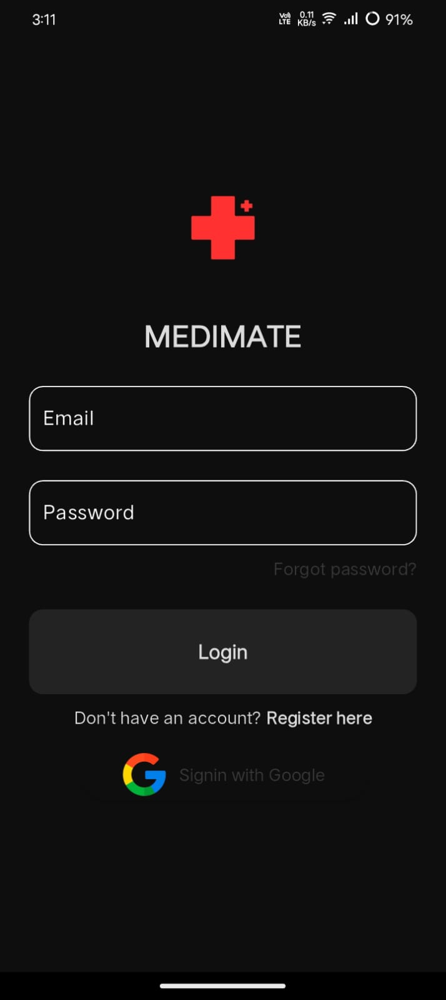
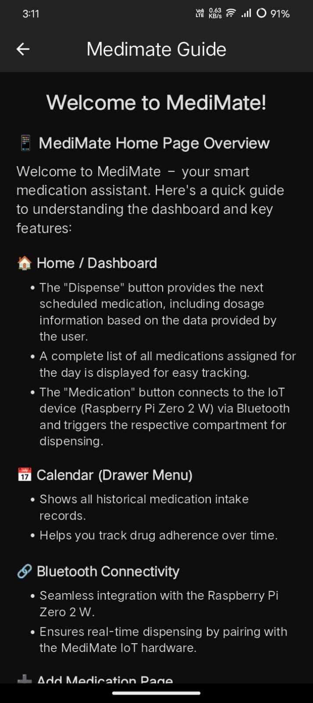
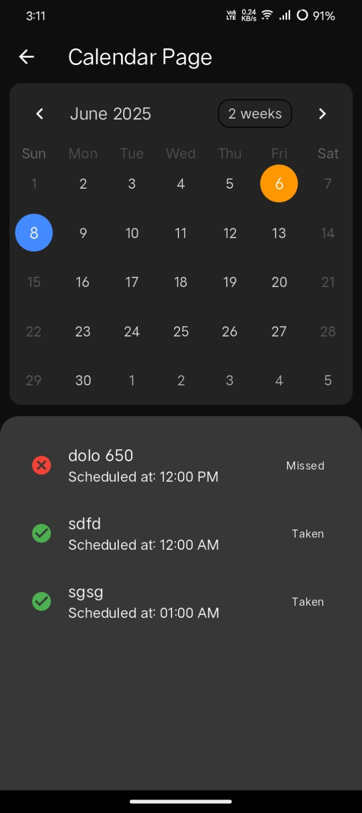
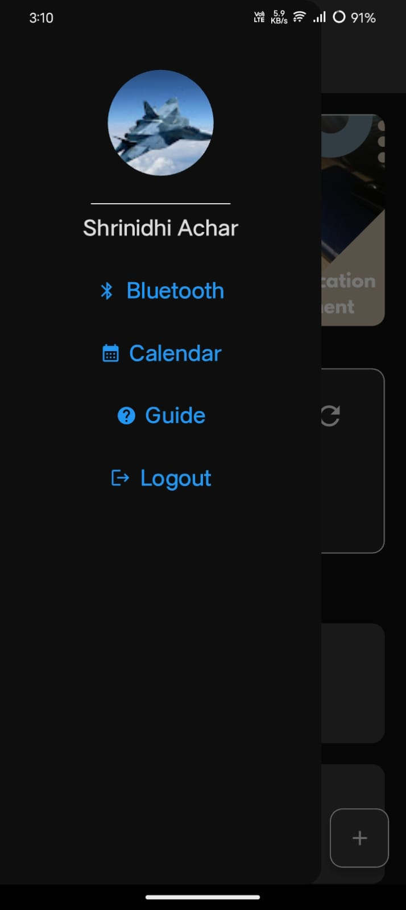
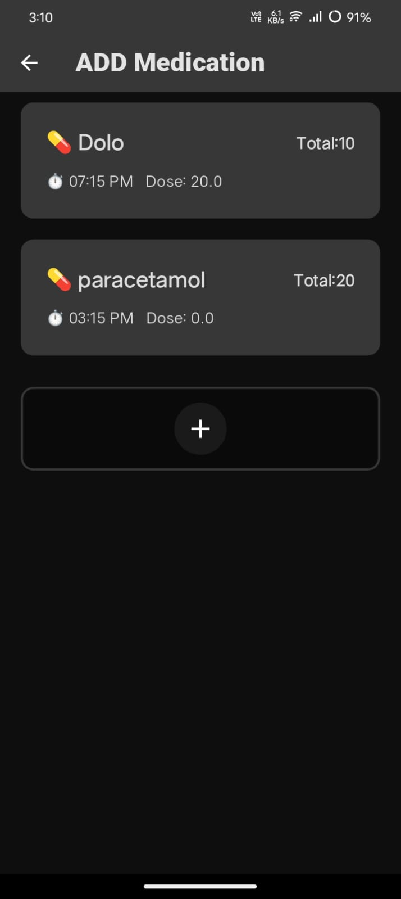
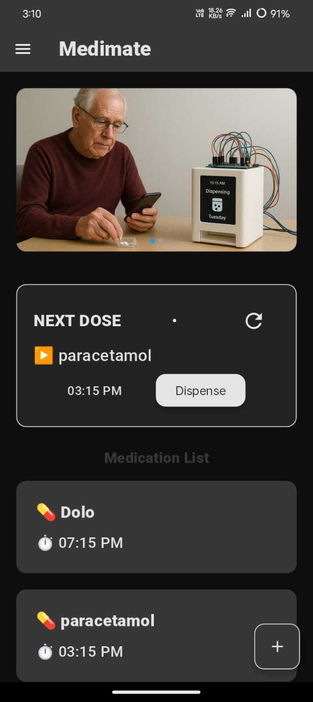

# 💊 Medimate - IoT-Based Smart Tablet Dispenser

**Medimate** is an IoT-based Flutter application that works in sync with a smart hardware dispenser system to automate and monitor the intake of medications. It is specifically designed for elderly individuals and patients with chronic illnesses who need timely reminders and caregivers' support for medication adherence.

---

## 🧠 Problem Statement

Medication non-adherence can lead to serious health issues, especially among the elderly and cognitively impaired. Existing manual methods like pill boxes or alarms lack real-time tracking and remote monitoring.

---

## 🚀 Features

- 🔄 **Automatic Tablet Dispensing** using servo motors
- ☁️ **Real-time Database Sync** with Firebase
- 📱 **Flutter Mobile App** for scheduling & monitoring
- 🔔 **Notifications** for medicine intake and refill alerts
- 🔊 **Buzzer/Speaker Alerts** for dispensing confirmation
- 🔋 **Battery-Powered Operation** with portability
- 👨‍⚕️ **Remote Monitoring** by caregivers via cloud

---

## 🛠️ Tech Stack

| Component            | Purpose                                    |
|----------------------|--------------------------------------------|
| Raspberry Pi Zero 2 W | Main controller (Wi-Fi + GPIO)             |
| Servo Motors (x2)     | Physical dispensing mechanism              |
| Firebase Realtime DB  | Cloud storage for schedules & logs         |
| Flutter (Android/iOS) | User interface for scheduling & alerts     |
| Buzzer/Speaker        | Audio feedback for users                   |
| Li-Po Battery         | Portable power supply                      |
| MQTT (Optional)       | Efficient IoT messaging protocol           |

---

## 📱 Flutter App Functionality

- Users or caregivers set medication schedules via the app.
- App writes schedule data to Firebase Realtime Database.
- Raspberry Pi checks schedule and dispenses tablets on time.
- App receives and displays:
    - ✔️ Tablet dispensed
    - ❌ Missed dose and Record
    - ⚠️ Low inventory alert
    - 🔔 Notification

---

## 🔗 How It Works

1. User configures schedule in the Flutter app.
2. Raspberry Pi fetches schedule from Firebase.
3. On time match, servo dispenses a tablet.
4. Firebase updates and notifies the app.
5. App alerts user via push notification and audio alert.

---

## 📦 Installation

1. **Flutter App**
    - Clone this repository
    - Run `flutter pub get`
    - Configure Firebase in `firebase_options.dart`
    - Run on a connected Android/iOS device

2. **Raspberry Pi Setup**
    - Install Python3 and required libraries (`requests`, `firebase_admin`, etc.)
    - Connect servo motors, buzzer
    - Deploy script to monitor time and control dispensing

---

## 📸 Demo Screenshots (Optional)

   &nbsp;
  

   &nbsp;
  

   &nbsp;
  

## 🤝 Contributors

- Shrinidhi Achar — App & System Developer

---

## 📃 License

This project is for educational and healthcare prototyping purposes. Contact the owner for commercial use.

---

## 📬 Contact

For questions or contributions, email: **shrinidhi857@gmail.com**
